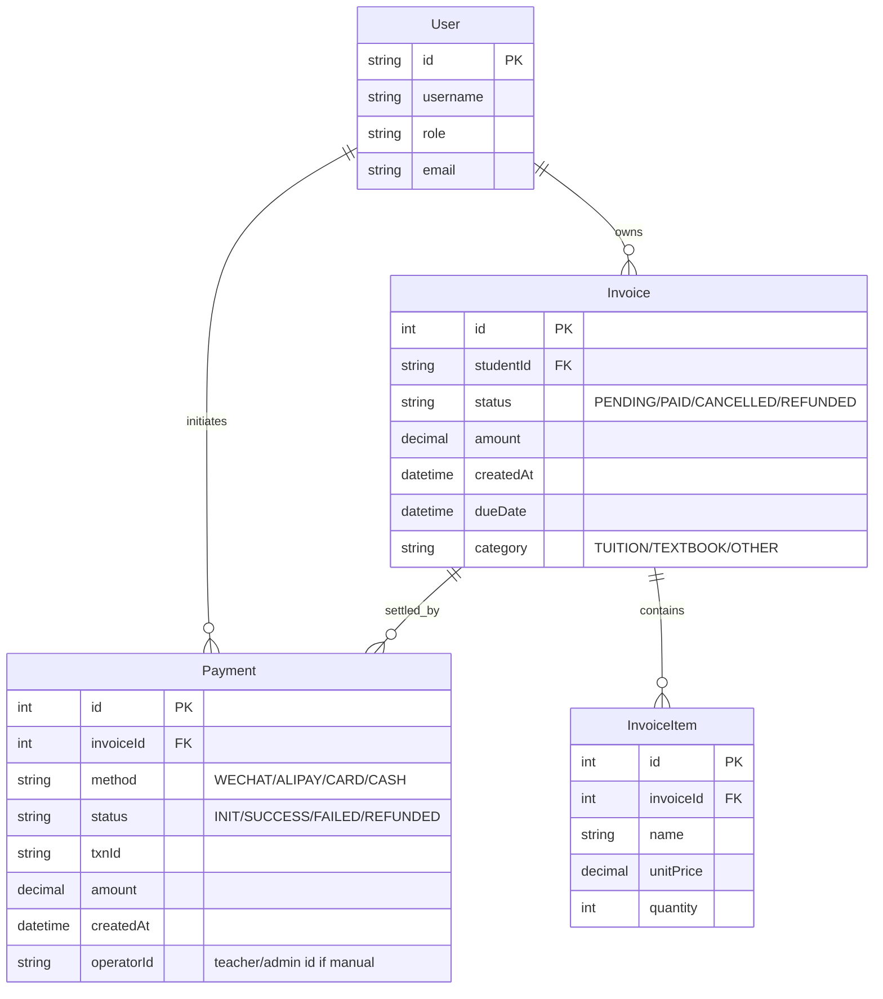
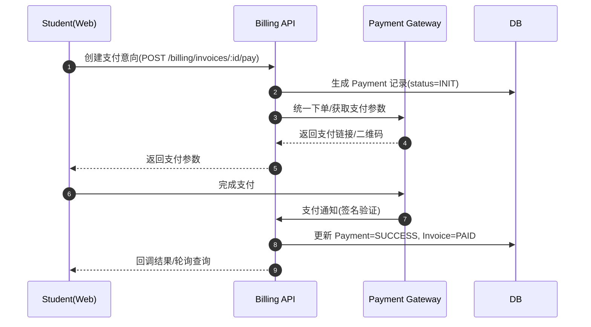
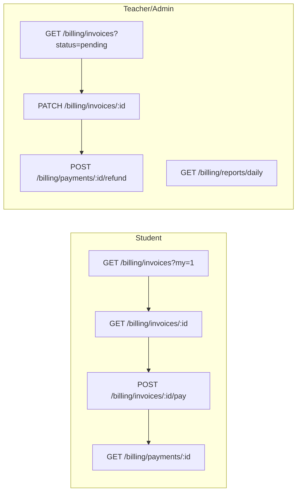

# 学生账务模块技术调研与设计说明

> 说明：当前代码库未包含“学生账务/支付/订单”等相关实现。本文在全面梳理现有架构（学生资源与问答模块）的基础上，提出学生账务模块的技术设计与扩展计划，以支持后续教师与管理员账户的开发。

## 一、项目架构与目录组织

- 前端（React + TypeScript）
  - 路由与角色守卫：`client/src/App.tsx:57`（`StudentRoute` 基于 `localStorage.role` 控制访问）
  - 页面：`client/src/pages/student/*`，涵盖资源中心与问答社区
  - 公共组件：`client/src/components/common/*`（`Toast.tsx`、`Pagination.tsx`、`Sidebar.tsx` 等）
  - 编辑器：`client/src/components/editor/RichText.tsx`
  - 服务层：`client/src/services/*`（`api.ts` 基础封装、`resources.ts`、`uploads.ts`、`courses.ts`）
  - 常用 Hook：`client/src/hooks/*`（权限、通知、数据拉取）

- 后端（Node.js + Express + Prisma）
  - 路由入口：`server/src/index.ts`（注册所有子路由）
  - 鉴权中间件：`server/src/middleware/auth.ts:18`（`requireAuth` 基于 JWT）
  - 缓存：`server/src/cache.ts`（提供 `cacheGet/cacheSet` 与失效机制）
  - 业务路由：
    - 资源：`server/src/routes/resources.ts`（上传/详情/下载计数）
    - 问答：`server/src/routes/qa.ts`（提问列表/详情/创建/修改/删除）
    - 回答：`server/src/routes/answers.ts`（教师回答并推送通知）
    - 通知：`server/src/routes/notifications.ts`
    - 课程：`server/src/routes/courses.ts`
    - 鉴权：`server/src/routes/auth.ts`
  - 数据库：`server/prisma/schema.prisma`（Users/Courses/Resources/Questions/Answers/Notifications）

## 二、核心模块依赖关系与公共组件用法

- 前端依赖关系
  - 页面通过 `services/*` 调用后端 API（统一走 `apiFetch`，附带 `Authorization` 与 `X-User-Id`，见 `client/src/services/api.ts:4–24`）
  - 上传统一经 `UploadsApi`（`client/src/services/uploads.ts`），表单成功统一通过 `Toast` 提示（`client/src/components/common/Toast.tsx`）
  - 导航统一使用 `react-router-dom` 的 `useNavigate`（例如资源上传页：`client/src/pages/student/ResourceUpload.tsx:162`）

- 后端依赖关系
  - 路由 → Prisma ORM → PostgreSQL；鉴权中间件将 `userId/role` 写入 `req` 供业务层使用（`server/src/middleware/auth.ts:11–13`）
  - 缓存用于问答列表与通知列表加速（`server/src/routes/qa.ts:48–57`，`server/src/routes/notifications.ts:15–21`）

## 三、现有学生模块的业务流程与数据流

- 资源中心
  - 上传：前端多步校验 → 文件上传 → 资源创建（`client/src/pages/student/ResourceUpload.tsx:135–170` → 后端 `server/src/routes/resources.ts:138–160`）
  - 浏览/搜索/分页：`client/src/pages/student/Resources.tsx` 通过 `ResourcesApi.list` 拉取（`client/src/services/api.ts:35–51` → `server/src/routes/resources.ts:70–91`）
  - 详情与下载计数：`client/src/pages/student/ResourceDetail.tsx` → `server/src/routes/resources.ts:93–121,196–205`

- 问答社区
  - 发布提问：`client/src/pages/student/QAPublish.tsx:36–62` → `server/src/routes/qa.ts:74–93`
  - 列表：`client/src/pages/student/QA.tsx` → `server/src/routes/qa.ts:30–61`
  - 回答推送通知：`server/src/routes/answers.ts:22–35` 与通知拉取 `server/src/routes/notifications.ts:7–21`

## 四、数据库表与关联（现有）

- Users ↔ Courses（教师授课）
- Courses ↔ Resources（资源归属课程）
- Courses ↔ Questions（提问归属课程）
- Questions ↔ Answers（教师回答关联问题）
- Users ↔ Notifications（用户收到通知）

参考：`server/prisma/schema.prisma:11–89`

## 五、权限控制与校验（现有）

- JWT 鉴权：登录签发 `sub/role`（`server/src/routes/auth.ts:118–121`），后续鉴权中间件解析写入 `req`（`server/src/middleware/auth.ts:9–13`）
- 资源/问答创建均要求登录（`requireAuth`），同时进行了请求体验证与参数校验（例如课程名非纯数字：`server/src/routes/resources.ts:33–36`）
- 管理端 RBAC 具备基础材料（`Agent.md` 与 `需求文档.md`），但后端尚未实现管理员全量路由集。

## 六、学生账务模块的设计（新增）

> 目标：支持学生缴费（学费/教材费等）、账单查看、订单支付流水、退款/调整，以及与教师/管理员角色的审核与对账。

### 6.1 数据库设计（ER）

### 6.2 业务流程与数据流

### 6.3 接口设计与权限

- 权限策略（示例）：
  - 学生：仅可访问自己的账单与支付记录。
  - 教师：可查看本课程相关的教材费账单、可提交线下缴费的入账记录（`operatorId`）。
  - 管理员：可全量查看/修改账单、生成报表、执行退款审计。

### 6.4 异常处理与校验规则

- 订单状态机：`PENDING → PAID → REFUNDED/CANCELLED`，状态逆转需审核与日志记录。
- 金额校验：服务端统一 `decimal` 精度处理，禁止浮点累加误差；所有金额以最小货币单位存储（例如分）。
- 幂等性：支付通知处理需幂等（依据 `txnId`），重复通知不应重复入账。
- 安全：支付通知验签（网关公钥），参数签名与回调来源校验；屏蔽敏感日志。

## 七、可扩展性评估与改造点

- 可直接复用
  - 鉴权中间件与角色路由守卫：`server/src/middleware/auth.ts`，`client/src/App.tsx:57`
  - Toast 通知与统一 `apiFetch`：`client/src/components/common/Toast.tsx`，`client/src/services/api.ts`
  - 列表分页与筛选 UI：参考 `client/src/pages/student/Resources.tsx`

- 需扩展的接口
  - 新增 `server/src/routes/billing/*`：发票/支付/报表路由与控制器
  - Swagger 文档扩充：`server/src/swagger.ts` 增加 Billing API

- 权限控制调整
  - 在 `authOptional` 中扩展 `userRole` 利用；路由层统一 RBAC gate（如 `requireRole('ADMIN')`）
  - 管理员控制面板：新增账务审计页与退款审批流程

- 公共组件增强
  - 表格组件/导出组件：支持报表导出（CSV/Excel）
  - 统一的“步骤条/状态标签”组件，用于账单状态展示

## 八、技术文档与图示清单

- 架构说明：本文件第 1–5 节
- 关键业务流程时序图：第 6.2 节 mermaid
- 数据库 ER 图：第 6.1 节 mermaid
- 接口调用关系图：第 6.3 节 mermaid

## 九、后续开发计划（教师/管理员）

- 功能边界
  - 教师：课程相关账单查看、线下缴费登记、部分纠错操作（受限）。
  - 管理员：全局账务配置、账单生成策略、退款/作废审批、报表与审计。

- 新增模块与组件
  - 后端：`billing` 路由与服务层、支付网关适配器、通知/回调处理器。
  - 前端：账务列表页、发票详情页、支付页、报表页；公共表格与状态组件。

- 修改的现有代码
  - `App.tsx` 增加角色路由与菜单项；`Sidebar.tsx` 增加“账务中心”。
  - `services/api.ts` 扩展 Billing API 封装。
  - `swagger.ts` 增加账务端点说明。

- 技术难点与方案
  - 支付对接：采用网关统一抽象（SDK/REST），本地以 `Mock` 驱动联调，再切换真实网关。
  - 幂等与一致性：引入支付事务表与唯一约束，回调逻辑加锁或去重。
  - 报表性能：分页与聚合分离，定时离线汇总（可选 Redis 缓存）。

---

以上内容将作为后续“学生账务模块”的落地蓝图，并与现有资源/问答模块的架构保持一致，以降低接入成本与维护复杂度。

